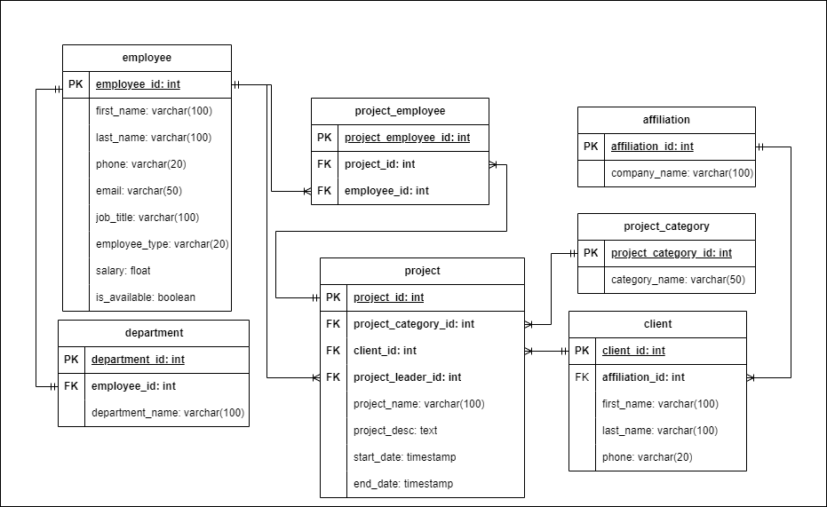

# Pac Project Database Design

# Mission Statement
PacProject is a company that provides services in technology project development, including creating applications such as websites and mobile apps, maintaining systems, IT consulting, and other related services. You have been tasked with building a database for PacProject to organize the projects they have worked on. For each project, a project team will be selected by the company, consisting of employees from different departments, and there will be a project leader assigned to each project. Each project will have a different duration, depending on the agreement with the client. Therefore, you will organize the completed projects and the employees who worked on them through a relational database.

For further clarification, here are the facts and constraints of this task:

1. Employees can only work or be in one department.
2. Each department has one leader or manager.
3. Department managers are part of the company's employees.
4. The projects received are divided into several categories: Network Analysis, IT Consultant, App Development, and Managed Services.
5. Each project must have at least one employee working on it.
6. Each project has a leader responsible for organizing the project team.
7. PacProject stores data on clients who hire/use their services.
8. An employee can work on multiple projects at the same time.
9. An employee may also not work on a particular project, as the employee is responsible for handling internal PacProject affairs.

# Table Structures

In order to design our database, first let's determine what tables are required in this database.

| Table Name | Description | 
| --- | --- | 
| employee | Store general information for PacProject's employee |
| department | Store information list of PacProject's department.  Each department are led by one Department Manager (employee)
| project | Store information about project accepted by PacProjects |
| project_category | Store information about available category of each project |
| project_employee | Store information about which employee are working for which project |
| client | Store information about client of the project's and their affiliation |

# ER Diagram

After deciding required tables, we can create ER diagram that contain all of those table, relationship between them, field for each table, and primary-foreign key that are needed.

# Establishing Business Rule

Below we are gonna establish business rule that apply to all of the tables that we've created in the ERD.

1. Table: employee
Business Rule:
    - All fields can't be null
    - Employee type value must be in: Full-time, Contract
    - Salary must be > 0 
    - Employee who works on internal project will have their is_available set to False, and can't work on project yet
    
2. Table: department
Business Rule:
    - All field can't be null
    - Only one employee can be leader on one department
    - The relationship with the employee table is mandatory, and the data in the department table can be deleted only if there are no related data in the employee table

3. Table: affiliation
Business Rule:
    - All field can't be null

4. Table: client
Business Rule:
    - All field can't be null
    - The relationship with the affiliation table is mandatory, and the data in the client table can be deleted only if there are no related data in the affiliation table

5. Table: project_category
Business Rule:
    - All field can't be null

6. Table: project
Business Rule:
    - All field that contain key(primary, foreign) and project name can't be null
    - The relationship between project_employee, project_category, client, and employee is mandatory. 
    - The data on client can't be deleted because it shows the one who request the project
    - The data on project_category can be deleted only if there are no related data in the project table
    - The data on employee can be deleted only if there are no related data in the project table
    
7. Table: project_employee
Business Rule:
    - All field can't be null
    - The relationship between employee and project are mandatory
    - The data on employee can be deleted, and related data on project_employee will be deleted as well
    - The data on project can be deleted, and related data on project_employee will be deleted as well